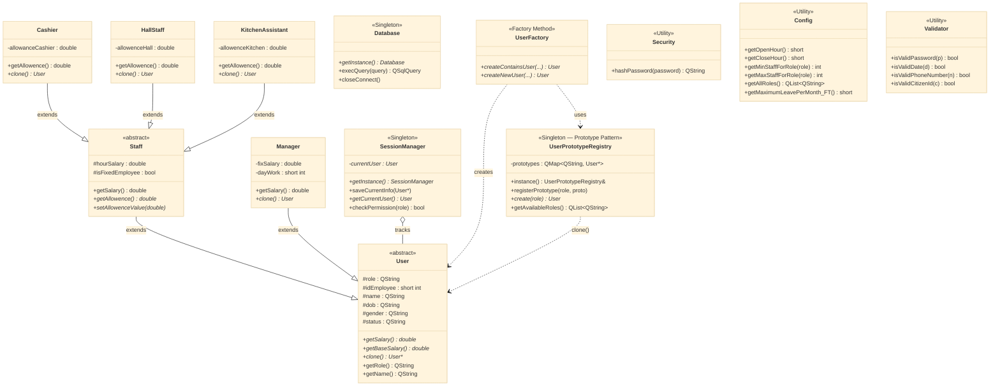
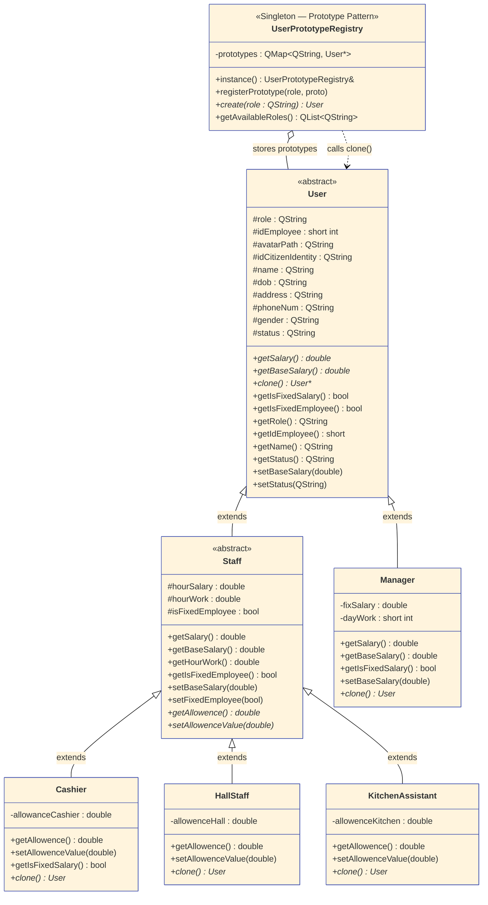
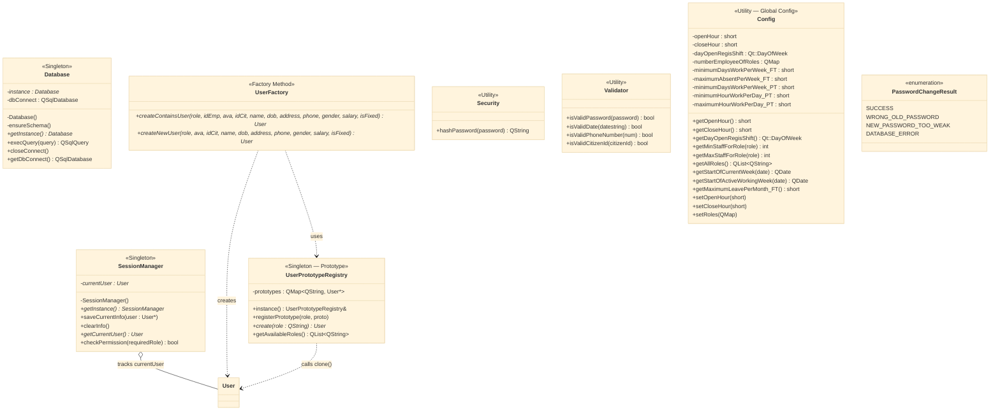
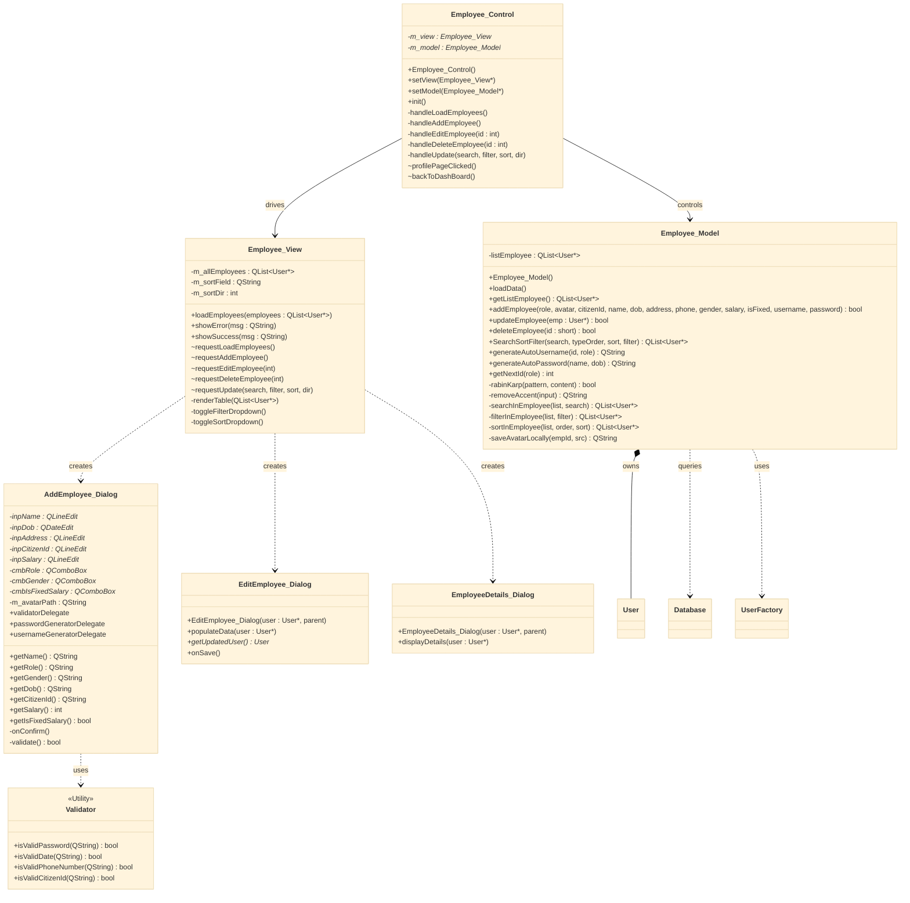

# UML Class Diagram — Optimus Management Application

> Paste từng block vào **[mermaid.live](https://mermaid.live)** → xuất PNG/SVG chèn báo cáo.

---

## Kịch bản chia sơ đồ

| Hình | Tiêu đề | Nội dung |
|------|---------|---------|
| **0A** | Tổng quan — Domain & Infrastructure | Hierarchy thực thể + Singleton/Factory/Prototype |
| **0B** | Tổng quan — Models Layer | Toàn bộ lớp Model + Entities + Algorithm |
| **0C** | Tổng quan — Controllers, Views & Navigation | Toàn bộ Controller + View + Dialog + Navigator |
| **1** | Domain Model chi tiết | Đầy đủ attributes/methods, Prototype Pattern |
| **2** | Infrastructure chi tiết | Database, SessionManager, Config, Validator... |
| **3** | Employee Management chi tiết | CRUD, Rabin-Karp search, 3 dialogs |
| **4** | Schedule & Leave Request chi tiết | Optimizer MCMF/SPFA, LeaveRequest, Notification |
| **5** | Salary, Profile, Setting & Navigation chi tiết | Salary, Profile slidePanel, Setting, Navigator |

---

## Hình 0A — Tổng quan: Domain & Infrastructure

---

## Hình 0B — Tổng quan: Models Layer

```mermaid
%%{init: {'theme': 'base', 'themeVariables': {'fontSize': '15px'}}}%%
classDiagram
    classDef modelClass  fill:#FFF9C4,stroke:#F9A825,stroke-width:2.5px,color:#3e2800
    classDef entityClass fill:#E8EAF6,stroke:#3949AB,stroke-width:2px,color:#1a237e
    classDef algoClass   fill:#FCE4EC,stroke:#B71C1C,stroke-width:2.5px,color:#7f0000
    classDef dtoClass    fill:#ECEFF1,stroke:#546E7A,stroke-width:2px,color:#263238
    classDef dbClass     fill:#FFCCBC,stroke:#BF360C,stroke-width:2px,color:#3e0000

    class Database {
        <<Singleton>>
        +getInstance() Database*
        +execQuery(query) QSqlQuery
    }

    class Login_Model {
        +verifyLogin(user, pass) User*
        +logOut()
    }
    class Employee_Model {
        -listEmployee : QList~User*~
        +loadData()
        +addEmployee(...) bool
        +updateEmployee(User*) bool
        +deleteEmployee(short) bool
        +SearchSortFilter(...) QList~User*~
        -rabinKarp(pattern, content) bool
        -removeAccent(input) QString
    }
    class Profile_Model {
        +updateProfile(...) bool
        +updatePassword(...) PasswordChangeResult
        +checkIfUserExist(id, pass) bool
    }
    class Change_password {
        +updatePassword(id, old, new) PasswordChangeResult
        -verifyOldPassword(id, old) bool
        -validatePasswordStrength(new) bool
        -executePasswordUpdate(id, hash) bool
    }
    class Salary_Model {
        +getSalarySummary(id, role, base, month, year) SalaryData
        +getNormalDaysData(...) QMap
        +getHolidayDaysData(...) QMap
    }
    class Dashboard_Model {
        +getWorkingEmployeeIds() QSet~int~
        +getNextShiftEmployees() QList~ShiftEmployeeInfo~
        +getSalaryStats(year) SalaryChartData
    }
    class Setting_Model {
        +loadData(openHour, closeHour, dayOpenRegis, roles, ...) bool
        +saveData(openHour, closeHour, dayOpenRegis, roles, ...) bool
    }
    class Schedule_Model {
        -shiftList : QList~QList~Shift*~~
        -draftShifts : QList~Shift*~
        +checkOverlapping(...) bool
        +getManagerWeeklyGrid(...) QMap
        +applyManagerScheduleChanges(...) bool
        +previewGeneratedSchedule(weekStart) AutoSchedulePreview
        +getFullTimeScheduleGrid(...) FullTimeScheduleGrid
        +approveShift(id) bool
        +declineShift(id) bool
        +generateSchedule() QStringList
        +saveDraftShiftsToDatabase() bool
    }
    class LeaveRequest_Model {
        +getActiveShiftsForWeek(empId, weekStart) QList~LeaveShiftOption~
        +submitLeaveRequest(empId, shiftId, reason) bool
        +getLeaveRequestsForEmployee(empId) QList~LeaveRequestInfo~
        +getPendingLeaveRequests() QList~LeaveRequestInfo~
        +decideLeaveRequest(reqId, managerId, approved, reason) bool
    }
    class Notification_Model {
        +getNotifications(empId, filter) QList~NotificationInfo~
        +getUnreadCount(empId) int
        +markAsRead(notifId, empId) bool
        +markAllAsRead(empId) bool
        +create(db, recipientId, type, title, msg, ...) bool
        +getManagerRecipientIds(db) QList~int~
    }
    class Shift {
        -shiftId : int
        -EmployeeID : int
        -date : QString
        -startTime : QString
        -endTime : QString
        -status : QString
        +getShiftId() int
        +getStatus() QString
        +setStatus(QString)
    }
    class Optimizer {
        <<Min Cost Max Flow>>
        -feasible : bool
        -totalFlow : int
        -warnings : QStringList
        +solve() bool
        +isFeasible() bool
        +getWarnings() QStringList
        -spfa(...) bool
        -minCostFlow(...) int
        -solveForRole(...) RoleSolveResult
    }

    Login_Model ..> Database : queries
    Employee_Model ..> Database : queries
    Profile_Model ..> Database : queries
    Profile_Model ..> Change_password : delegates
    Salary_Model ..> Database : queries
    Dashboard_Model ..> Database : queries
    Setting_Model ..> Database : queries
    Schedule_Model ..> Database : queries
    Schedule_Model *-- Shift : owns
    Schedule_Model ..> Optimizer : runs
    LeaveRequest_Model ..> Database : queries
    LeaveRequest_Model ..> Notification_Model : triggers
    Notification_Model ..> Database : queries

    class Login_Model:::modelClass
    class Employee_Model:::modelClass
    class Profile_Model:::modelClass
    class Change_password:::modelClass
    class Salary_Model:::modelClass
    class Dashboard_Model:::modelClass
    class Setting_Model:::modelClass
    class Schedule_Model:::modelClass
    class LeaveRequest_Model:::modelClass
    class Notification_Model:::modelClass
    class Shift:::entityClass
    class Optimizer:::algoClass
    class Database:::dbClass
```

---

## Hình 0C — Tổng quan: Controllers, Views & Navigation

```mermaid
%%{init: {'theme': 'base', 'themeVariables': {'fontSize': '14px'}}}%%
classDiagram
    classDef controlClass fill:#C8E6C9,stroke:#2E7D32,stroke-width:2.5px,color:#1b5e20
    classDef viewClass    fill:#BBDEFB,stroke:#1565C0,stroke-width:2.5px,color:#0d47a1
    classDef dialogClass  fill:#F3E5F5,stroke:#7B1FA2,stroke-width:2px,color:#4a148c
    classDef navClass     fill:#EDE7F6,stroke:#7B1FA2,stroke-width:2.5px,color:#4a148c
    classDef widgetClass  fill:#E3F2FD,stroke:#1565C0,stroke-width:2px,color:#0d47a1

    %% --- MASTER NAVIGATION ---
    class Control_Navigator {
        <<Master Controller>>
        +loginController : Login_Control*
        +dashboardController : Dashboard_Control*
        +profileController : Profile_Control*
        +employeeController : Employee_Control*
        +scheduleController : Schedule_Control*
        +salaryController : Salary_Control*
        +viewScheduleController : ViewSchedule_Control*
        +settingController : Setting_Control*
        +notificationController : Notification_Control*
        +viewWindow : View_Navigator*
        +switchTab(index : int)
    }
    class View_Navigator {
        +loginPage : Login_View*
        +dashboardPage : Dashboard_View*
        +profilePage : Profile_View*
        +employeePage : Employee_View*
        +schedulePage : Schedule_View*
        +salaryPage : Salary_View*
        +viewSchedulePage : ViewSchedule_View*
        +settingPage : Setting_View*
        +notificationPage : Notification_View*
        +sidebar : Sidebar_Widget*
        +setPageIndex(int)
        ~logoutSubmitted()
    }
    class Sidebar_Widget {
        +loadUserData(SessionManager*)
        +setPermission(bool)
        +setNotificationCount(int)
        +updateButtonStyles(int)
        ~menuClicked(pageIndex : int)
        ~logoutClicked()
    }

    %% --- CONTROLLERS ---
    class Login_Control {
        +handleLoginSubmission()
    }
    class Dashboard_Control {
        +init()
        -onLeaveRequestReviewRequested(id, approved)
    }
    class Employee_Control {
        +init()
        -handleAddEmployee()
        -handleEditEmployee(int)
        -handleDeleteEmployee(int)
        -handleUpdate(search, filter, sort, dir)
    }
    class Profile_Control {
        +loadUserData()
        +handleProfileUpdate(...)
        +handlePasswordUpdate(old, new)
    }
    class Salary_Control {
        +loadData(month, year)
    }
    class Schedule_Control {
        +load()
        +handleGenSchedule()
        -onShiftBlockClicked(col, row)
        -onApproveShift(info)
        -onDeclineShift(info)
        -onAddEmployeesToShift(...)
        -onConfirmRequested()
        -onLeaveRequested()
        -onUndoManagerDraft()
        ~scheduleGenerated(bool, int, QStringList)
    }
    class ViewSchedule_Control {
        +loadData()
        -loadStaffSchedule()
        -loadManagerSchedule()
    }
    class Notification_Control {
        +load()
        +refreshUnreadCount()
        -reviewLeaveRequest(notifId, leaveId)
        ~unreadCountChanged(int)
    }
    class Setting_Control {
        +loadSettings()
        +saveSettings()
    }

    %% --- VIEWS ---
    class Login_View {
        +clearInputs()
        ~loginSubmitted(user, pass)
        ~loginSuccessful()
    }
    class Dashboard_View {
        +updateNextShiftPanel(QList)
        +updateAbsentPanel(QList)
        +updateLeaveRequestPanel(QList)
        +updateSalaryChart(...)
        ~leaveRequestReviewRequested(int, bool)
    }
    class Employee_View {
        +loadEmployees(QList~User*~)
        +showError(QString)
        ~requestAddEmployee()
        ~requestEditEmployee(int)
        ~requestDeleteEmployee(int)
        ~requestUpdate(...)
    }
    class Profile_View {
        -editProfileWidget : EditProfile_Widget*
        -editPasswordWidget : EditPassword_Widget*
        +loadUserData(SessionManager*)
    }
    class Salary_View {
        +populateSummaryTable(SalaryData)
        ~monthYearChanged(int, int)
    }
    class Schedule_View {
        +renderGrid()
        ~saveGridRequested(...)
        ~shiftBlockClicked(col, row)
    }
    class ViewSchedule_View { +updateSchedule() }
    class Notification_View { +updateNotificationsList() }
    class Setting_View { +updateSettings() }

    %% --- DIALOGS & WIDGETS ---
    class AddEmployee_Dialog {
        +getName() QString
        +getRole() QString
        +getIsFixedSalary() bool
        -validate() bool
    }
    class EditEmployee_Dialog {
        +populateData(User*)
        +getUpdatedUser() User*
    }
    class EmployeeDetails_Dialog {
        +displayDetails(User*)
    }
    class EditProfile_Widget {
        -isPanelOpen : bool
        +slideIn()
        +slideOut()
        ~saveRequested(...)
    }
    class EditPassword_Widget {
        -isPanelOpen : bool
        +slideIn()
        +slideOut()
        ~saveRequested(old, new)
    }
    class ManagerEmployeeChooser_Dialog {
        +selections() QList~ManagerEmployeeSelection~
        -rebuildTable()
        -updateConfirmState()
    }

    %% --- RELATIONSHIPS ---
    Control_Navigator --> View_Navigator : routes
    Control_Navigator *-- Login_Control
    Control_Navigator *-- Dashboard_Control
    Control_Navigator *-- Employee_Control
    Control_Navigator *-- Profile_Control
    Control_Navigator *-- Salary_Control
    Control_Navigator *-- Schedule_Control
    Control_Navigator *-- ViewSchedule_Control
    Control_Navigator *-- Notification_Control
    Control_Navigator *-- Setting_Control
    View_Navigator *-- Sidebar_Widget

    Login_Control --> Login_View : drives
    Dashboard_Control --> Dashboard_View : drives
    Employee_Control --> Employee_View : drives
    Profile_Control --> Profile_View : drives
    Salary_Control --> Salary_View : drives
    Schedule_Control --> Schedule_View : drives
    ViewSchedule_Control --> ViewSchedule_View : drives
    Notification_Control --> Notification_View : drives
    Setting_Control --> Setting_View : drives

    Employee_View ..> AddEmployee_Dialog : creates
    Employee_View ..> EditEmployee_Dialog : creates
    Employee_View ..> EmployeeDetails_Dialog : creates
    Profile_View *-- EditProfile_Widget : owns
    Profile_View *-- EditPassword_Widget : owns
    Schedule_View ..> ManagerEmployeeChooser_Dialog : creates

    class Control_Navigator:::navClass
    class View_Navigator:::navClass
    class Sidebar_Widget:::navClass
    class Login_Control:::controlClass
    class Dashboard_Control:::controlClass
    class Employee_Control:::controlClass
    class Profile_Control:::controlClass
    class Salary_Control:::controlClass
    class Schedule_Control:::controlClass
    class ViewSchedule_Control:::controlClass
    class Notification_Control:::controlClass
    class Setting_Control:::controlClass
    class Login_View:::viewClass
    class Dashboard_View:::viewClass
    class Employee_View:::viewClass
    class Profile_View:::viewClass
    class Salary_View:::viewClass
    class Schedule_View:::viewClass
    class ViewSchedule_View:::viewClass
    class Notification_View:::viewClass
    class Setting_View:::viewClass
    class AddEmployee_Dialog:::dialogClass
    class EditEmployee_Dialog:::dialogClass
    class EmployeeDetails_Dialog:::dialogClass
    class ManagerEmployeeChooser_Dialog:::dialogClass
    class EditProfile_Widget:::widgetClass
    class EditPassword_Widget:::widgetClass
```

---

## Bảng màu theo tầng MVC

| Màu | Tầng | Áp dụng cho |
|-----|------|------------|
| 🟣 Tím nhạt | Domain / Abstract | `User`, `Staff`, `Manager`, `Cashier`... |
| 🔵 Xanh dương | Model | `*_Model`, `Change_password`, `Optimizer` |
| 🟢 Xanh lá | Controller | `*_Control`, `*_Control` |
| 🟡 Vàng | View | `*_View`, `*_Widget` |
| 🌸 Hồng | Dialog | `*_Dialog` |
| 🔴 Đỏ cam | Infrastructure | `Database`, `SessionManager`, `UserFactory`... |
| ⚪ Xám | DTO / Struct / Enum | `*Info`, `*Data`, `*DTO` |

---

## Hình 1 — Domain Model & Prototype Pattern

---

## Hình 2 — Infrastructure Layer

---

## Hình 3 — Employee Management

---

## Hình 4 — Schedule & Leave Request

```mermaid
%%{init: {'theme': 'base', 'themeVariables': {'fontSize': '14px'}}}%%
classDiagram
    classDef modelClass   fill:#FFF9C4,stroke:#F9A825,stroke-width:2.5px,color:#3e2800
    classDef controlClass fill:#C8E6C9,stroke:#2E7D32,stroke-width:2.5px,color:#1b5e20
    classDef algoClass    fill:#FCE4EC,stroke:#B71C1C,stroke-width:2.5px,color:#7f0000
    classDef entityClass  fill:#E8EAF6,stroke:#3949AB,stroke-width:2px,color:#1a237e
    classDef dtoClass     fill:#ECEFF1,stroke:#546E7A,stroke-width:2px,color:#263238
    classDef dialogClass  fill:#F3E5F5,stroke:#7B1FA2,stroke-width:2px,color:#4a148c

    class Shift {
        -shiftId : int
        -EmployeeID : int
        -date : QString
        -dayOfWeek : QString
        -startTime : QString
        -endTime : QString
        -status : QString
        +getShiftId() int
        +getEmployeeID() int
        +getDate() QString
        +getStartTime() QString
        +getEndTime() QString
        +getStatus() QString
        +setStatus(QString)
    }

    class ShiftBlock {
        -date : QString
        -startTime : QTime
        -endTime : QTime
        -employees : QList~User*~
        +addStaff(u : User*)
        +getStatus() QString
        +getDate() QString
        +getEmployees() QList~User*~
    }

    class Optimizer {
        <<Min Cost Max Flow Algorithm>>
        -shifts : QVector~Shift*~
        -userMinutes : QMap~User*, int~
        -m_edges : QVector~Edge~
        -m_g : QVector~QVector~int~~
        -feasible : bool
        -totalFlow : int
        -totalCost : int
        -warnings : QStringList
        +Optimizer(shifts, userMinutes)
        +solve() bool
        +isFeasible() bool
        +getTotalFlow() int
        +getTotalCost() int
        +getWarnings() QStringList
        -init(n : int)
        -addEdge(u, v, cap, cost)
        -spfa(s, t, dist, prev_v, prev_e) bool
        -minCostFlow(s, t, maxFlow, outCost) int
        -solveForRole(role, shifts, minutes) RoleSolveResult
        -findUserById(id : short) User*
    }

    class Schedule_Model {
        -shiftList : QList~QList~Shift*~~
        -currentWeeklyUsers : QList~User*~
        -draftShifts : QList~Shift*~
        +checkOverlapping(id, date, start, end) bool
        +getAcceptedSchedule(id, monday)
        +getPendingSchedule(id, monday)
        +getManagerWeeklyGrid(monday, status) QMap
        +getAssignBlockCounts(monday) QMap
        +getShiftsForBlock(monday, col, row) QList
        +getEligibleEmployees(date, start, end) QList~EligibleEmployeeInfo~
        +applyManagerScheduleChanges(changes) bool
        +validateManagerScheduleChanges(changes) QStringList
        +previewGeneratedSchedule(weekStart) AutoSchedulePreview
        +replacePendingShiftsForWeek(id, weekStart, regs) bool
        +ensurePendingCarryForwardForWeek(weekStart) bool
        +getFullTimeScheduleGrid(id, weekStart) FullTimeScheduleGrid
        +approveShift(shiftId) bool
        +declineShift(shiftId) bool
        +replaceShift(old, new) bool
        +generateSchedule() QStringList
        +saveDraftShiftsToDatabase() bool
        +clearDrafts()
    }

    class LeaveRequest_Model {
        +getActiveShiftsForWeek(empId, weekStart) QList~LeaveShiftOption~
        +submitLeaveRequest(empId, shiftId, reason, error) bool
        +getLeaveRequestsForEmployee(empId) QList~LeaveRequestInfo~
        +getPendingLeaveRequests() QList~LeaveRequestInfo~
        +decideLeaveRequest(reqId, managerId, approved, reason, error) bool
    }

    class Notification_Model {
        +getNotifications(empId, filter) QList~NotificationInfo~
        +getUnreadCount(empId) int
        +markAsRead(notifId, empId) bool
        +markLeaveRequestReviewed(notifId, empId, approved) bool
        +markAllAsRead(empId) bool
        +deleteAllRead(empId) bool
        +create(db, recipientId, type, title, msg, shiftId, leaveId) bool
        +getManagerRecipientIds(db) QList~int~
    }

    class Schedule_Control {
        -view : Schedule_View*
        -model : Schedule_Model*
        -currentEmployeeId : short
        -currentAssignMonday : QDate
        -layoutMode : EmployeeScheduleLayoutMode
        -managerDraftChanges : QList~ManagerScheduleChange~
        -leaveRequestModel : LeaveRequest_Model
        +setEmployeeId(id : short)
        +load()
        +handleGenSchedule()
        -onSaveGridRequested(selectedHoursByDay)
        -onSaveFullTimeScheduleRequested(selectedShiftsByDay)
        -onShiftBlockClicked(col, row)
        -onApproveShift(PendingShiftInfo)
        -onDeclineShift(PendingShiftInfo)
        -onAddEmployeesToShift(date, start, end, selections)
        -onRemoveAssignedShift(shiftId, empId, reason)
        -onConfirmRequested()
        -onLeaveRequested()
        -onLeaveHistoryRequested()
        -onUndoManagerDraft()
        ~scheduleGenerated(bool, int, QStringList)
    }

    class Notification_Control {
        -notificationModel : Notification_Model
        -leaveRequestModel : LeaveRequest_Model
        +setView(Notification_View*)
        +load()
        +refreshUnreadCount()
        -markRead(notifId)
        -markAllRead()
        -reviewLeaveRequest(notifId, leaveId)
        -openManagerSchedule(notifId)
        ~unreadCountChanged(int count)
        ~openManagerScheduleRequested()
    }

    class LeaveRequestInfo {
        <<struct DTO>>
        +id : int
        +employeeId : int
        +employeeName : QString
        +leaveDate : QDate
        +relatedShiftId : int
        +reason : QString
        +status : QString
        +requestedAt : QDateTime
        +decidedAt : QDateTime
        +decidedBy : int
        +decisionReason : QString
    }

    class LeaveShiftOption {
        <<struct DTO>>
        +shiftId : int
        +date : QDate
        +startTime : QTime
        +endTime : QTime
        +status : int
    }

    class NotificationInfo {
        <<struct DTO>>
        +id : int
        +recipientEmployeeId : int
        +type : QString
        +title : QString
        +message : QString
        +status : QString
        +relatedShiftId : int
        +relatedLeaveRequestId : int
        +createdAt : QDateTime
        +readAt : QDateTime
    }

    class AutoSchedulePreview {
        <<struct DTO>>
        +changes : QList~ManagerScheduleChange~
        +warnings : QStringList
        +approvedCount : int
        +declinedCount : int
    }

    class EligibleEmployeeInfo {
        <<struct DTO>>
        +employeeId : int
        +employeeName : QString
        +role : QString
        +isFixedSalary : bool
        +eligible : bool
        +reason : QString
    }

    class ManagerEmployeeChooser_Dialog {
        -m_employees : QList~EligibleEmployeeInfo~
        -m_states : QMap~int, SelectionState~
        -m_blockStart : QTime
        -m_blockEnd : QTime
        -m_table : QTableWidget*
        +ManagerEmployeeChooser_Dialog(employees, blockStart, blockEnd, init)
        +selections() QList~ManagerEmployeeSelection~
        -rebuildTable()
        -acceptSelection()
        -updateConfirmState()
    }

    Schedule_Control --> Schedule_Model : controls
    Schedule_Control --> LeaveRequest_Model : uses
    Schedule_Model *-- Shift : owns
    Schedule_Model ..> Optimizer : runs
    Schedule_Model ..> Database : queries
    Schedule_Model ..> AutoSchedulePreview : returns
    Schedule_Model ..> EligibleEmployeeInfo : returns
    ShiftBlock o-- User : contains
    LeaveRequest_Model ..> LeaveRequestInfo : returns
    LeaveRequest_Model ..> LeaveShiftOption : returns
    LeaveRequest_Model ..> Notification_Model : triggers
    LeaveRequest_Model ..> Database : queries
    Notification_Model ..> NotificationInfo : returns
    Notification_Model ..> Database : queries
    Notification_Control --> Notification_Model : uses
    Notification_Control --> LeaveRequest_Model : uses
    Schedule_View ..> ManagerEmployeeChooser_Dialog : creates

    class Shift:::entityClass
    class ShiftBlock:::entityClass
    class Optimizer:::algoClass
    class Schedule_Model:::modelClass
    class LeaveRequest_Model:::modelClass
    class Notification_Model:::modelClass
    class Schedule_Control:::controlClass
    class Notification_Control:::controlClass
    class LeaveRequestInfo:::dtoClass
    class LeaveShiftOption:::dtoClass
    class NotificationInfo:::dtoClass
    class AutoSchedulePreview:::dtoClass
    class EligibleEmployeeInfo:::dtoClass
    class ManagerEmployeeChooser_Dialog:::dialogClass
```

---

## Hình 5 — Salary, Profile, Setting & Navigation

```mermaid
%%{init: {'theme': 'base', 'themeVariables': {'fontSize': '14px'}}}%%
classDiagram
    classDef modelClass   fill:#FFF9C4,stroke:#F9A825,stroke-width:2.5px,color:#3e2800
    classDef controlClass fill:#C8E6C9,stroke:#2E7D32,stroke-width:2.5px,color:#1b5e20
    classDef viewClass    fill:#BBDEFB,stroke:#1565C0,stroke-width:2.5px,color:#0d47a1
    classDef widgetClass  fill:#E3F2FD,stroke:#1565C0,stroke-width:2px,color:#0d47a1
    classDef dtoClass     fill:#ECEFF1,stroke:#546E7A,stroke-width:2px,color:#263238
    classDef navClass     fill:#EDE7F6,stroke:#7B1FA2,stroke-width:2.5px,color:#4a148c

    class SalaryData {
        <<struct DTO>>
        +normalHours : int
        +holidayHours : int
        +normalSalary : int
        +holidaySalary : int
        +penalty : int
        +totalSalary : int
    }

    class Salary_Model {
        -currentUser : User*
        +getSalarySummary(id, role, base, month, year) SalaryData
        +getNormalDaysData(id, role, base, month, year) QMap
        +getHolidayDaysData(id, role, base, month, year) QMap
    }

    class Salary_View {
        -isFixedEmployee : bool
        +setBaseSalary(salary : QString)
        +setEmployeeType(isFixed : bool)
        +populateNormalTable(data : QMap)
        +populateHolidayTable(data : QMap)
        +populateSummaryTable(data : SalaryData)
        ~monthYearChanged(month, year)
    }

    class Salary_Control {
        -view : Salary_View*
        -model : Salary_Model*
        -currentSession : SessionManager*
        +loadData(month, year)
        -onMonthYearChanged(int, int)
    }

    class Change_password {
        +updatePassword(empId, oldPass, newPass) PasswordChangeResult
        -verifyOldPassword(empId, oldPass) bool
        -validatePasswordStrength(newPass) bool
        -executePasswordUpdate(empId, hashedPass) bool
    }

    class Profile_Model {
        +updateProfile(id, name, dob, address, phone, citizenId, avatar, gender) bool
        +updatePassword(id, oldPass, newPass) PasswordChangeResult
        +checkIfUserExist(id, password) bool
    }

    class Profile_Control {
        -view : Profile_View*
        -model : Profile_Model
        -currentSession : SessionManager*
        +loadUserData()
        +handleProfileUpdate(name, dob, address, phone, citizenId, avatar, gender)
        +handlePasswordUpdate(oldPass, newPass)
    }

    class Profile_View {
        -editProfileWidget : EditProfile_Widget*
        -editPasswordWidget : EditPassword_Widget*
        +loadUserData(session : SessionManager*)
        -on_btnEditInfo_clicked()
        -on_btnEditPassword_clicked()
    }

    class EditProfile_Widget {
        -animation : QPropertyAnimation*
        -isPanelOpen : bool
        +setInitialData(name, dob, address, phone, citizenId, avatar, gender)
        +slideIn()
        +slideOut()
        ~saveRequested(name, dob, address, phone, citizenId, avatar, gender)
        -onSaveClicked()
        -onChangeAvatarClicked()
    }

    class EditPassword_Widget {
        -animation : QPropertyAnimation*
        -isPanelOpen : bool
        +txtOldPassword : password_LineEdit*
        +txtNewPassword : password_LineEdit*
        +txtConfirmPassword : password_LineEdit*
        +slideIn()
        +slideOut()
        ~saveRequested(oldPassword, newPassword)
        -onSaveClicked()
    }

    class Setting_Model {
        +loadData(openHour, closeHour, dayOpenRegis, roles, maxLeaveFT, maxDaysPT, maxHourPT) bool
        +saveData(openHour, closeHour, dayOpenRegis, roles, maxLeaveFT, maxDaysPT, maxHourPT) bool
    }

    class Setting_Control {
        -view : Setting_View*
        -model : Setting_Model*
        +loadSettings()
        +saveSettings()
    }

    class Setting_View {
        +updateSettings()
    }

    class ShiftEmployeeInfo {
        <<struct DTO>>
        +name : QString
        +phone : QString
        +role : QString
        +avatarPath : QString
    }

    class SalaryChartData {
        <<struct DTO>>
        +lastYearMonthly : QVector~double~
        +thisYearMonthly : QVector~double~
        +lastYearEmpCount : int
        +thisYearEmpCount : int
    }

    class Dashboard_Model {
        +getWorkingEmployeeIds() QSet~int~
        +getNextShiftEmployees() QList~ShiftEmployeeInfo~
        +getSalaryStats(year) SalaryChartData
    }

    class Dashboard_Control {
        -view : Dashboard_View*
        -model : Dashboard_Model
        -currentSession : SessionManager*
        +init()
        -onYearChanged(int year)
        -onLeaveRequestReviewRequested(id, approved)
    }

    class Dashboard_View {
        +clearEmployeeGrid()
        +addEmployeeCard(EmployeeCard*)
        +updateNextShiftPanel(QList~ShiftEmployeeInfo~)
        +updateAbsentPanel(QList~ShiftEmployeeInfo~)
        +updateLeaveRequestPanel(QList~LeaveRequestInfo~)
        +updateSalaryChart(lastYear, thisYear, lastCount, thisCount, year)
        ~profileClicked()
        ~yearChanged(int year)
        ~leaveRequestReviewRequested(int, bool)
    }

    class Control_Navigator {
        <<Master Controller>>
        -currentSession : SessionManager*
        +loginController : Login_Control*
        +dashboardController : Dashboard_Control*
        +profileController : Profile_Control*
        +employeeController : Employee_Control*
        +scheduleController : Schedule_Control*
        +salaryController : Salary_Control*
        +viewScheduleController : ViewSchedule_Control*
        +settingController : Setting_Control*
        +notificationController : Notification_Control*
        +viewWindow : View_Navigator*
        +Control_Navigator()
        +switchTab(index : int)
    }

    class View_Navigator {
        -controller : Control_Navigator*
        +loginPage : Login_View*
        +dashboardPage : Dashboard_View*
        +profilePage : Profile_View*
        +employeePage : Employee_View*
        +schedulePage : Schedule_View*
        +salaryPage : Salary_View*
        +viewSchedulePage : ViewSchedule_View*
        +settingPage : Setting_View*
        +notificationPage : Notification_View*
        +sidebar : Sidebar_Widget*
        +setPageIndex(index : int)
        +getSideBar() Sidebar_Widget*
        ~logoutSubmitted()
    }

    class Sidebar_Widget {
        +loadUserData(session : SessionManager*)
        +setPermission(permitted : bool)
        +updateButtonStyles(mainIndex : int)
        +setNotificationCount(count : int)
        +hideSubMenuInSchedule()
        ~menuClicked(pageIndex : int)
        ~logoutClicked()
    }

    Salary_Control --> Salary_Model : controls
    Salary_Control --> Salary_View : drives
    Salary_Model ..> SalaryData : returns
    Salary_Model ..> Database : queries

    Profile_Control --> Profile_Model : controls
    Profile_Control --> Profile_View : drives
    Profile_Model ..> Change_password : delegates
    Profile_Model ..> Database : queries
    Profile_View *-- EditProfile_Widget : owns
    Profile_View *-- EditPassword_Widget : owns

    Setting_Control --> Setting_Model : controls
    Setting_Control --> Setting_View : drives
    Setting_Model ..> Config : updates
    Setting_Model ..> Database : queries

    Dashboard_Control --> Dashboard_Model : controls
    Dashboard_Control --> Dashboard_View : drives
    Dashboard_Model ..> Database : queries

    Control_Navigator *-- Salary_Control
    Control_Navigator *-- Profile_Control
    Control_Navigator *-- Setting_Control
    Control_Navigator *-- Dashboard_Control
    Control_Navigator --> View_Navigator : routes
    View_Navigator *-- Sidebar_Widget

    class SalaryData:::dtoClass
    class ShiftEmployeeInfo:::dtoClass
    class SalaryChartData:::dtoClass
    class Salary_Model:::modelClass
    class Profile_Model:::modelClass
    class Change_password:::modelClass
    class Setting_Model:::modelClass
    class Dashboard_Model:::modelClass
    class Salary_Control:::controlClass
    class Profile_Control:::controlClass
    class Setting_Control:::controlClass
    class Dashboard_Control:::controlClass
    class Salary_View:::viewClass
    class Profile_View:::viewClass
    class Setting_View:::viewClass
    class Dashboard_View:::viewClass
    class EditProfile_Widget:::widgetClass
    class EditPassword_Widget:::widgetClass
    class Control_Navigator:::navClass
    class View_Navigator:::navClass
    class Sidebar_Widget:::navClass
```

